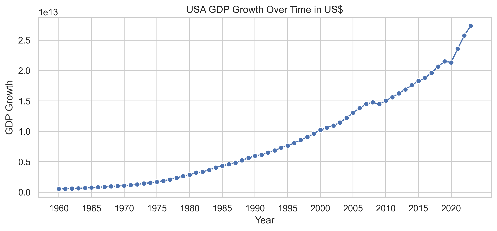
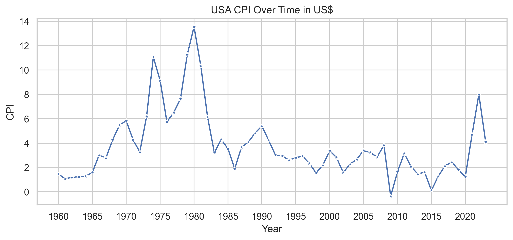
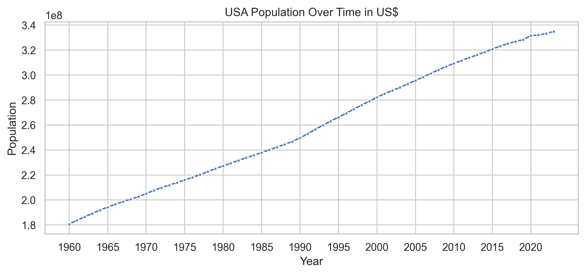
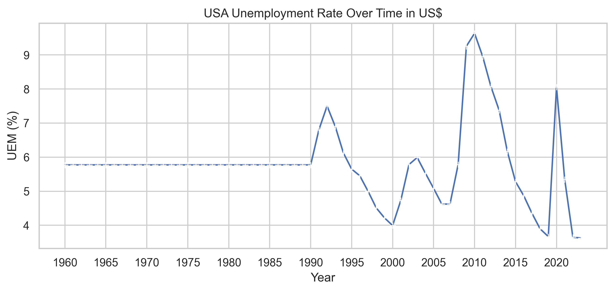
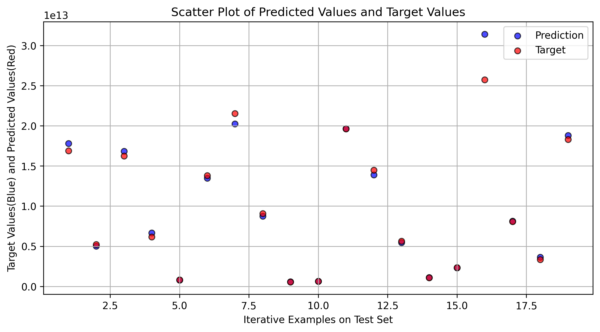
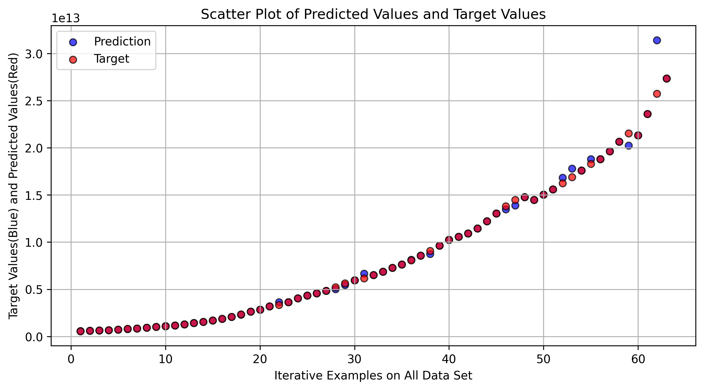

# Project Name: Alazying and ETL Processing with US Economics data.


## Project Overview.

Implement an ETL (Extract, Transform, Load) pipeline that extracts the financial data from World Bank Data API, transforming it according to certain rules, and loading it into a target database(PostgeSQL). Additionally, I also create two extra part of this system to visualize data and apply a basic machine learning model(Multiple Linear Regression - MLR) on the data.


Data flow architecture. Need to mofidy a little of project flow.


Dashboard for visualizarion


## Objectives.

- Learn to extract data from source(API).
- Understand data cleaning and preprocessing.
- Practice storing data in a structured database.
- Gain familiarity with ETL processes and workflows.
- Develop skills in data transformation and normalization.
- Apply some basic Machine Learning model in a real dataset.
- Visualize data to gain deeper insight for further purposes.

## Skills.

- API usage 
- Data processing
- Data modeling
- SQL

## Tools and Technologies.

- Python(requests, wbgapi, pandas, numpy, scikit-learn, matplotlib, seaborn).
- SQL database(PostgreSQL).
- Docker for further deployment. But unavailable in this project at that time.

# How to implement step by step.

## Setting up Python environment.

Before you begin, make sure you have Python installed on your system. Then, install the required library:

```bash
pip install wbgapi pandas
pip install pandas
pip install psycopg2
pip install scikit-learn
pip install sqlalchemys
```

Python installation.(Download from python.org website) and Check Python available on local machine. 

```bash
pip install --upgrade pip
python --version
```

## Postgres Installation and Instance Creating.
Download postgreSQL on postgresql.org website.
Run the following command on terminal to check available version:
```bash 
postgres --version
```
Using "psql" and run the following command on terminal to create instance of postgres database: (Another option is creating database and table in Python using psycopg library)

Using psql:
```bash
psql --help # for more information

psql --version # check psql version

psql -U postgres  # create instance using default.Password:postgres

create database usa_economics; # create database

\list # list all databases

\q # quit psql
```

## Running ETL process

### Extract data

Step 1: Start by importing the wbgapi library, which is the official Python client library for accessing the World Bank's API, along with other required libraries such as pandas for data handling.
```python
import wbgapi as wb
```

Step 2: Fetch Available Indicators
To get a list of all available indicators from the World Bank database, use the wbgapi.series.info() method. This will return a list of all indicators that can be queried.
```python
wb.series.info()
```

<b>In this project will choose 100 important indicators from my point of view. All of these are listed in <i>/config/env-config.txt</i> .Access it for more details </b>


Option: Fetch Data for All Indicators for the United States - wbgapi.data.DataFrame("USA") function
```python
wb.data.DataFrame("USA")
```

Step 4: Save the Data to "raw-data.csv"
```python
wb.data.DataFrame("USA").to_csv("../data/raw-data/raw-data.csv")
```

### Transform

Step 1: Inspect the Data to understand the data structure, types, and summary statistics.
```python
DataFrame.head() 
DataFrame.info()
DataFrame.describe()
```


Step 2: Handle Missing Data

```python
DataFrame.dropna()  #to remove rows or columns with missing values
DataFrame.fillna()  #to fill missing values with a specified value (e.g., zero or mean of the column).
```

Step3: Rename Columns if you want and convert data types if necessary (e.g., strings to numbers, or objects to datetime)

### Load (to database)

Step 1: Library importing:
```python
import psycopg2
from sqlalchemy import create_engine
```

Step 2: Create connection to PostgreSQL server to execute queries.
```python
con_args = {
    username="posgres",
    password="postgres",
    host="localhost",
    port="5432",
    database="usa_economics"

}
```
Step 3: Query execution. Including creating tables and importing data into each table. Read etl.py file for more details.


## Visualization and ML model evaluation.

### Visualization
Gross Domestic Product over times:


Consumer Price Index over times:


Population Trending over times:

Unemployment Rate Trending over times:


### Machine Learning Model

Using Linear Regression for the Dataset to find the best param for Model. Predicting GDP is an interesting topic as a begineer level project. These plot below are to demonstrate the Predicted Values in comparison with Targeted Values from the TestSet and All DataSet generally.

<p>1. Scatter Plot on a TestSet</p>

<p>2. Scatter Plot on All DataSet</p>


## End of Project.

# Conclusion
Thank you for exploring this data engineering project! We hope this README has provided you with a comprehensive overview of the project's purpose, setup, and usage.

# Contribution
If you’d like to contribute to this project, please follow these guidelines:

- Fork the repository and create a feature branch.
- Write clear and concise commit messages.
- Submit a pull request with a detailed description of your changes.

# Contact
For any questions or issues, feel free to open an issue in the repository or reach out to <i>anhnn281204@gmail.com</i>.


